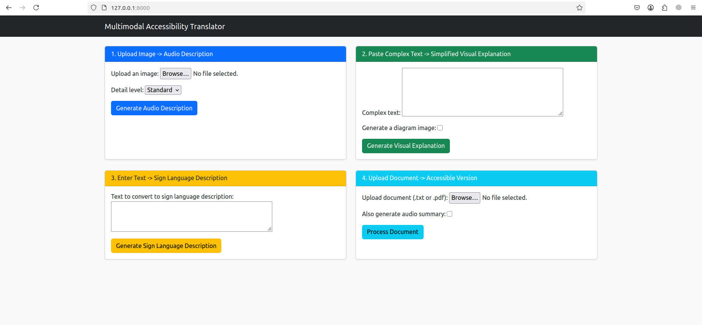
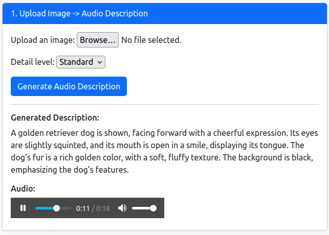
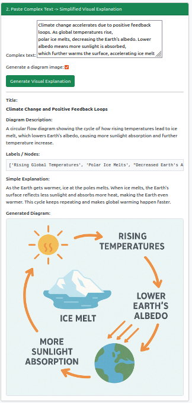
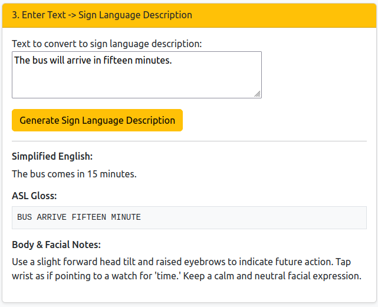
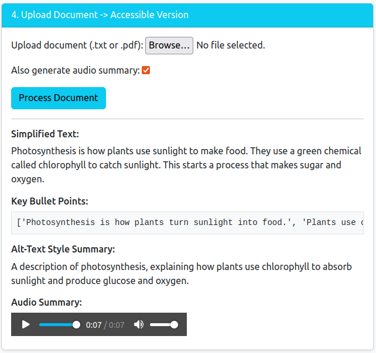
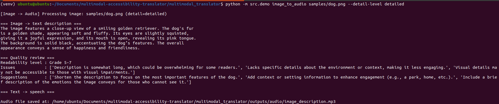
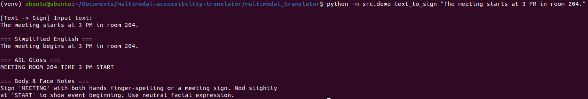

# Multimodal Accessibility Translator

This repository contains **two implementations** of the Multimodal Accessibility Translator:

1. **Django Web Application**
2. **Multi-Agent Python CLI**

Both use the **OpenAI Python SDK** for:
- Image -> Audio Description
- Complex Text -> Visual Explanation
- Text -> Sign Language Gloss
- Document -> Accessible Version

---

## Run Following Command to Get Started
    python -m venv venv
    source venv/bin/activate
    pip install -r requirements.txt

### 1. Django Web Application

#### Start the Web App
    cd multimodal_accessibility

#### Environment Setup

Create `.env`:
    OPENAI_API_KEY=sk-yourkeyhere

#### TO Run Server
    python manage.py makemigrations
    python manage.py migrate
    python manage.py runserver

Open in browser:
    http://127.0.0.1:8000/

#### Sample Screenshots
<table>
    <tr>
        <td></td>
        <td></td>
        <td></td>
        <td></td>
        <td></td>
    </tr>
</table>
---

### 2. Multi-Agent Python CLI
    cd multimodal_translator

#### Environment Setup

Create `.env`:
    OPENAI_API_KEY=sk-yourkeyhere

#### Image -> Audio Description
    python -m src.demo image_to_audio samples/dog.png --detail-level detailed

#### Text -> Sign Language Gloss
    python -m src.demo text_to_sign "The meeting starts at 3 PM in room 204."

#### Complex Text -> Visual Explanation
    python -m src.demo text_to_visual --text-file samples/complex_paragraph.txt --generate-image

#### Sample Screenshots
<table>
    <tr>
        <td></td>
        <td></td>
        <td></td>
    </tr>
</table>

---
